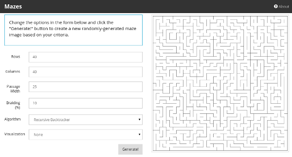

# Mazes for Programmers (Groovy port)

I am reading the book "[Mazes for Programmers](https://pragprog.com/book/jbmaze/mazes-for-programmers)" by Jamis Buck, which has its example code 
written in Ruby. While Ruby is a great language, Groovy is my language of choice; so, as part of reading the book, I am loosely porting the code
from the book to Groovy.

Note: this is not intended to be an official port of the code from the book. I am making my own changes as I see fit. If you are reading the book and
want the Groovy version of the code, you can at least have this as a general reference.

> Note: the current code is a very trimmed-down and refactored version of the ported Ruby code. If you want a more complete porting, closer to the 
original Ruby code, see the "[book](https://github.com/cjstehno/mazes/releases/tag/book)" tag.

## Maze Server

As an extra twist on this project, I am going to refactor it into a Spring Boot project providing a sub-set of the mazes as an online maze generator.

### Supports

* Quadrilateral mazes only
* Allow download of the generated image
* Selection of row/column count (within bounds)
* Algorithm selection
    * binaryTree
    * sidewinder
    * aldousBroder
    * wilsons
    * huntAndKill
    * recursiveBacktracker
    * kruskals
    * simplifiedPrims
    * truePrims
    * recursiveDivision
        * with(out) rooms
* The insets will be hard-coded per algorithm to give the best views
* Braiding on mazes that will allow it
* Flooding to show paths
* Shortest/longest path visualization

* No wave or masking support - that seems a bit more cumbersome for this little fun project.

## Building

> TBD...

## Running

> TBD...

## Deploying (Heroku)

> TBD...
